# Manual de Usuario - MiFutbolC

## Introducción

Bienvenido a **MiFutbolC**, el sistema completo de gestión y análisis de datos para fútbol desarrollado en lenguaje C. Esta aplicación profesional le permite administrar todos los aspectos relacionados con el fútbol, desde la gestión de equipamiento hasta el análisis avanzado de rendimiento.


### ¿Qué es MiFutbolC?

MiFutbolC es una herramienta integral diseñada para:
- Gestionar camisetas, canchas, equipos y partidos de fútbol
- Analizar estadísticas y rendimiento de manera profesional
- Realizar seguimiento de lesiones y salud de jugadores
- Gestionar finanzas del equipo (ingresos y gastos)
- Organizar torneos y temporadas completas
- Exportar e importar datos en múltiples formatos
- Ofrecer un sistema gamificado de logros y recompensas
- Registrar bienestar integral (hábitos, salud y planificación)
- Recibir recomendaciones inteligentes del Entrenador IA

### Beneficios Clave

**Gestión Completa**: Todo lo relacionado con el fútbol en un solo lugar  
**Análisis Profesional**: Estadísticas avanzadas y meta-análisis  
**Seguimiento de Salud**: Gestión detallada de lesiones  
**Control Financiero**: Registro de ingresos y gastos por categorías  
**Gestión de Temporadas**: Seguimiento de ciclos deportivos completos  
**Exportación Flexible**: Múltiples formatos (CSV, JSON, HTML, TXT)  
**Informe PDF Mejorado**: Portada, secciones y más datos  
**Sistema Gamificado**: Logros y badges para motivar el uso continuo  
**Bienestar Integral**: Hábitos, salud y reportes personales  
**Entrenador IA**: Recomendaciones inteligentes basadas en datos  
**Personalización**: Configuración de temas, idioma y preferencias  
- **Rutas de base de datos más robustas**: mejora interna en la construcción de rutas usando `snprintf`.
- **Logs más confiables**: ajustes en el formateo de mensajes para evitar inconsistencias en salidas de diagnóstico.
- **Gestión de imágenes optimizada**: mejoras en selección, resolución y actualización de rutas de imágenes de camisetas.
- **Mejor feedback en herramientas opcionales**: mensajes de éxito/advertencia más claros al configurar utilidades de imagen.

## Requisitos del Sistema

- **Sistema Operativo**: Windows, Linux o macOS
- **Compilador C**: GCC o MinGW
- **Herramientas Adicionales**:
  - CodeBlocks (recomendado para desarrollo)
  - Pandoc (opcional, para generar este manual en PDF)

## Instalación y Compilación

### Opción 1: Instalador Automático (Windows - Recomendado)

1. Navega a la carpeta `installer/` del proyecto
2. Ejecuta el archivo `MiFutbolC_Setup.exe`
3. Sigue las instrucciones del instalador
4. El programa se instalará automáticamente con todos los archivos necesarios
5. Busca "MiFutbolC" en el menú de inicio de Windows

### Opción 2: Usando CodeBlocks

1. Descarga e instala CodeBlocks desde [codeblocks.org](https://www.codeblocks.org/)
2. Abre el archivo `MiFutbolC.cbp` con CodeBlocks
3. Selecciona "Build" > "Build" para compilar (o presiona `Ctrl+F9`)
4. El ejecutable se generará en `bin/Debug/MiFutbolC.exe`
5. Ejecuta con `F9` o "Build" > "Build and Run"

### Opción 3: Compilación Manual

#### Linux / macOS (script)

```bash
# Compilar todos los archivos fuente
gcc -o MiFutbolC \
    main.c db.c menu.c camiseta.c partido.c equipo.c torneo.c \
    estadisticas.c estadisticas_generales.c estadisticas_anio.c \
    estadisticas_mes.c estadisticas_meta.c estadisticas_lesiones.c \
    analisis.c cancha.c logros.c lesion.c temporada.c \
    financiamiento.c settings.c entrenador_ia.c \
    records_rankings.c export.c export_all.c export_all_mejorado.c \
    export_camisetas.c export_camisetas_mejorado.c \
    export_lesiones.c export_lesiones_mejorado.c \
    export_partidos.c export_estadisticas.c \
    export_estadisticas_generales.c export_records_rankings.c \
    import.c utils.c sqlite3.c cJSON.c \
    -I. -lm -lpthread -ldl

# Ejecutar el programa
./MiFutbolC
```

#### Windows (con MinGW)

```bash
gcc -o MiFutbolC.exe main.c db.c menu.c camiseta.c partido.c equipo.c torneo.c estadisticas.c estadisticas_generales.c estadisticas_anio.c estadisticas_mes.c estadisticas_meta.c estadisticas_lesiones.c analisis.c cancha.c logros.c lesion.c temporada.c financiamiento.c settings.c entrenador_ia.c records_rankings.c export.c export_all.c export_all_mejorado.c export_camisetas.c export_camisetas_mejorado.c export_lesiones.c export_lesiones_mejorado.c export_partidos.c export_estadisticas.c export_estadisticas_generales.c export_records_rankings.c import.c utils.c sqlite3.c cJSON.c -I.
```

### Opción 4: Usando scripts del proyecto

#### Linux / macOS

```bash
chmod +x Instalador-Linux.sh
./Instalador-Linux.sh

# Debug
./Instalador-Linux.sh --debug

# Compilar y ejecutar
./Instalador-Linux.sh run
```

#### Windows (script)

```bash
mingw32-make

# Debug
mingw32-make BUILD_TYPE=Debug
```

En Linux/macOS, `Instalador-Linux.sh` también puede validar dependencias e instalar un launcher en `PATH`.

## Primer Uso

Al ejecutar el programa por primera vez:

1. Se abrirá el flujo de **inicio de sesión multiusuario local**
2. Podrás crear tu primer usuario local (o elegir uno existente)
3. Cada perfil usará su propia base de datos SQLite
   - **Windows**: `%LOCALAPPDATA%\MiFutbolC\data\mifutbol_<usuario>.db`
   - **Linux/macOS**: `./data/mifutbol_<usuario>.db`

   Además, se utiliza un registro de usuarios locales:
   - **Windows**: `%LOCALAPPDATA%\MiFutbolC\data\users.db`
   - **Linux/macOS**: `./data/users.db`

   También se crea automáticamente el archivo de log de actividad:
   - **Windows**: `%LOCALAPPDATA%\MiFutbolC\data\mifutbol_<usuario>.log`
   - **Linux/macOS**: `./data/mifutbol_<usuario>.log`

4. Podrás definir contraseña opcional para tu perfil
5. Se mostrarán los directorios de exportación e importación

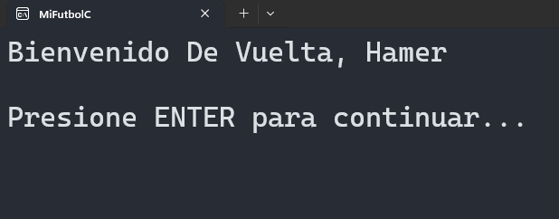

## Menú Principal

El menú principal ofrece las siguientes opciones:

1. **Camisetas** - Gestionar camisetas de fútbol
2. **Canchas** - Gestionar canchas de fútbol
3. **Equipos** - Gestionar equipos (fijos y momentáneos)
4. **Partidos** - Gestionar partidos
5. **Lesiones** - Gestionar lesiones de jugadores
6. **Estadísticas** - Ver estadísticas por categorías y rendimiento
7. **Logros** - Gestionar logros y badges
8. **(Reservado)** - Actualmente sin módulo asignado
9. **Financiamiento** - Gestionar finanzas del equipo
10. **Torneos** - Gestionar torneos de fútbol
11. **Temporada** - Gestionar temporadas y ciclos deportivos
12. **Análisis** - Ver análisis de rendimiento, comparador y Entrenador IA
13. **Bienestar** - Planificación, hábitos, salud y reportes personales
14. **Ajustes** - Configurar temas, idioma, accesibilidad y herramientas
0. **Salir** - Cerrar el programa

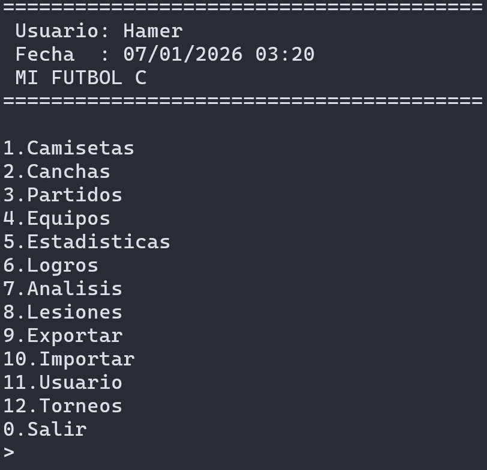

## Gestión de Camisetas

### Crear una Camiseta

1. Selecciona "1" en el menú principal
2. Elige "1" para crear una nueva camiseta
3. Ingresa el nombre de la camiseta
4. La camiseta se guardará en la base de datos con ID único

### Listar Camisetas

1. Selecciona "1" en el menú principal
2. Elige "2" para listar todas las camisetas
3. Se mostrarán todas las camisetas con sus estadísticas de uso

### Editar una Camiseta

1. Selecciona "1" en el menú principal
2. Elige "3" para editar una camiseta
3. Ingresa el ID de la camiseta a editar
4. Modifica el nombre según sea necesario

### Eliminar una Camiseta

1. Selecciona "1" en el menú principal
2. Elige "4" para eliminar una camiseta
3. Ingresa el ID de la camiseta a eliminar
4. Confirma la eliminación

### Sortear Camiseta

1. Selecciona "1" en el menú principal
2. Elige "5" para sortear una camiseta
3. El sistema seleccionará una camiseta disponible al azar
4. Si todas ya fueron sorteadas, reinicia automáticamente el ciclo

### Cargar Imagen de Camiseta

Cuando uses la opción de cargar imagen para una camiseta:

1. El sistema copiará la imagen al directorio `Imagenes/`
2. Si detecta un optimizador disponible (por ejemplo ImageMagick), aplicará optimización automática
3. La imagen se guarda en formato optimizado para reducir tamaño y mantener buena calidad
4. Si no hay optimizador, se guarda una copia sin optimización

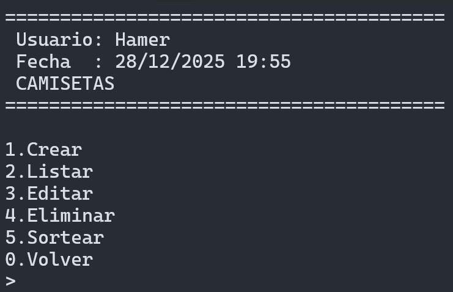

## Gestión de Canchas

### Crear una Cancha

1. Selecciona "2" en el menú principal
2. Elige "1" para crear una nueva cancha
3. Ingresa el nombre de la cancha

### Listar Canchas

1. Selecciona "2" en el menú principal
2. Elige "2" para listar todas las canchas
3. Se mostrarán con estadísticas de uso

### Editar una Cancha

1. Selecciona "2" en el menú principal
2. Elige "3" para editar una cancha
3. Ingresa el ID de la cancha a editar
4. Modifica el nombre según sea necesario

### Eliminar una Cancha

1. Selecciona "2" en el menú principal
2. Elige "4" para eliminar una cancha
3. Ingresa el ID de la cancha a eliminar
4. Confirma la eliminación

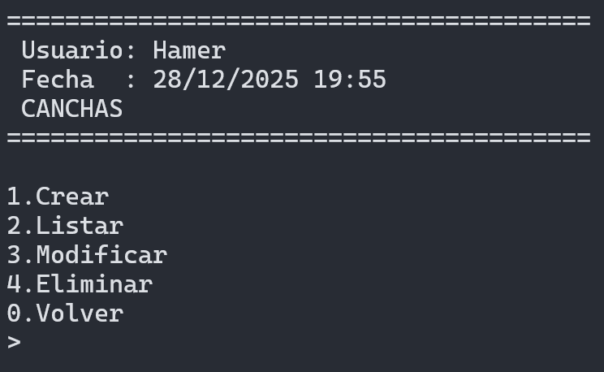

## Gestión de Equipos

Selecciona "3" en el menú principal para acceder al menú de gestión de equipos. Este módulo permite crear y administrar equipos de fútbol con diferentes configuraciones.

### Crear un Equipo

1. Selecciona "3" en el menú principal
2. Elige "1" para crear un nuevo equipo
3. Selecciona el tipo de equipo:
   - **Fijo**: Se guarda permanentemente en la base de datos
   - **Momentáneo**: Solo para uso temporal/simulación
4. Elige la modalidad de fútbol:
   - Fútbol 5
   - Fútbol 7
   - Fútbol 8
   - Fútbol 11
5. Ingresa el nombre del equipo
6. Agrega jugadores con sus datos:
   - Nombre del jugador
   - Número de camiseta
   - Posición (Arquero, Defensor, Mediocampista, Delantero)
7. Designa un capitán si es necesario
8. Para equipos fijos, se guardará en la base de datos

### Listar Equipos

1. Selecciona "3" en el menú principal
2. Elige "2" para listar todos los equipos
3. Se mostrarán todos los equipos con sus jugadores y formaciones

### Modificar un Equipo

1. Selecciona "3" en el menú principal
2. Elige "3" para modificar un equipo
3. Ingresa el ID del equipo a modificar
4. Actualiza la información del equipo y sus jugadores

### Eliminar un Equipo

1. Selecciona "3" en el menú principal
2. Elige "4" para eliminar un equipo
3. Ingresa el ID del equipo a eliminar
4. Confirma la eliminación

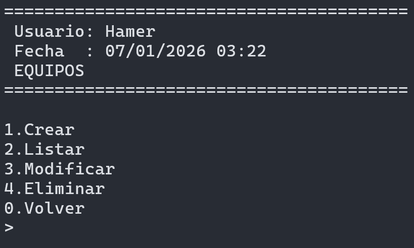

## Gestión de Partidos

### Crear un Partido

1. Selecciona "4" en el menú principal
2. Elige "1" para crear un nuevo partido
3. Selecciona la cancha donde se jugó
4. Ingresa la fecha y hora del partido
5. Ingresa las estadísticas:
   - Goles marcados
   - Asistencias realizadas
   - Rendimiento general (1-10)
   - Nivel de cansancio (1-10)
   - Estado de ánimo (1-10)
   - Resultado (Victoria, Empate, Derrota)
   - Clima (Soleado, Nublado, Lluvioso, etc.)
   - Comentario personal (opcional)
6. Selecciona la camiseta utilizada
7. El partido se guardará con todos los datos

### Listar Partidos

1. Selecciona "4" en el menú principal
2. Elige "2" para listar todos los partidos
3. Se mostrarán con todas las estadísticas

### Modificar un Partido

1. Selecciona "4" en el menú principal
2. Elige "3" para modificar un partido
3. Ingresa el ID del partido a modificar
4. Actualiza los datos según sea necesario

### Eliminar un Partido

1. Selecciona "4" en el menú principal
2. Elige "4" para eliminar un partido
3. Ingresa el ID del partido a eliminar
4. Confirma la eliminación

### Simular con Equipos Guardados

1. Selecciona "4" en el menú principal
2. Elige "5" para simular un partido con equipos guardados
3. Sigue el flujo para elegir los equipos y ejecutar la simulación

### Análisis Táctico

1. Selecciona "4" en el menú principal
2. Elige "6" para abrir análisis táctico
3. Podrás crear y visualizar diagramas tácticos

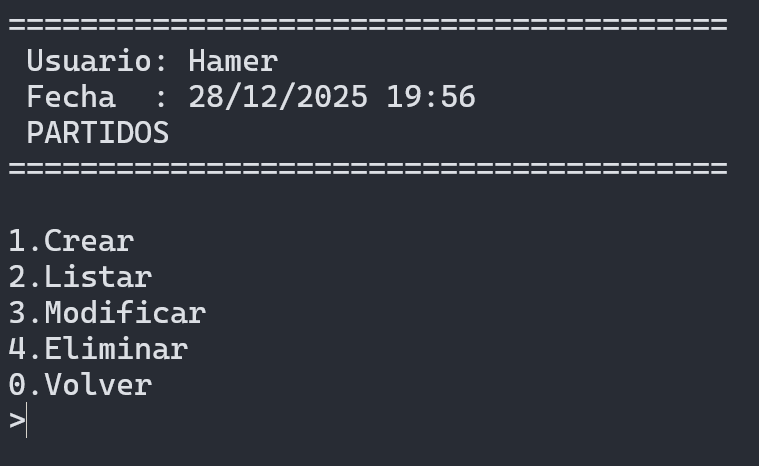

## Gestión de Lesiones

### Registrar una Lesión

1. Selecciona "5" en el menú principal
2. Elige "1" para registrar una nueva lesión
3. Ingresa el nombre del jugador
4. Selecciona el tipo de lesión (Muscular, Articular, Ósea, etc.)
5. Ingresa una descripción detallada
6. Especifica la fecha de la lesión
7. Indica la duración estimada de recuperación
8. Selecciona la camiseta asociada (opcional)
9. Asocia con un partido si aplica

### Listar Lesiones

1. Selecciona "5" en el menú principal
2. Elige "2" para listar todas las lesiones
3. Se mostrarán con detalles completos y estado

### Editar una Lesión

1. Selecciona "5" en el menú principal
2. Elige "3" para editar una lesión
3. Ingresa el ID de la lesión a editar
4. Modifica los datos según sea necesario

### Eliminar una Lesión

1. Selecciona "5" en el menú principal
2. Elige "4" para eliminar una lesión
3. Ingresa el ID de la lesión a eliminar
4. Confirma la eliminación

### Estadísticas y Herramientas de Lesiones

1. Selecciona "5" en el menú principal
2. Usa opciones adicionales del menú de lesiones:
   - "5" Estadísticas
   - "6" Diferencias entre lesiones
   - "7" Actualizar estados

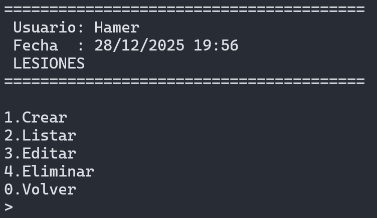

## Estadísticas

Selecciona "6" en el menú principal para acceder al menú de estadísticas. Este menú ofrece una amplia variedad de análisis estadísticos.

### Estadísticas Generales

Análisis completo del rendimiento de camisetas:

- Camiseta con más goles
- Camiseta con más asistencias
- Camiseta con más partidos jugados
- Camiseta con más goles + asistencias
- Camiseta con mejor rendimiento general promedio
- Camiseta con mejor estado de ánimo promedio
- Camiseta con menos cansancio promedio
- Camiseta con más victorias
- Camiseta con más empates
- Camiseta con más derrotas
- Camiseta más sorteada

### Estadísticas por Año y Mes

- **Estadísticas por Año**: Análisis histórico agrupado por año, mostrando partidos jugados, goles, asistencias y promedios por camiseta
- **Estadísticas por Mes**: Análisis histórico agrupado por mes, mostrando estadísticas detalladas por camiseta

### Estadísticas Avanzadas y Meta-Análisis

Análisis profundo del rendimiento:

- **Consistencia del Rendimiento**: Análisis de variabilidad, desviación estándar y coeficiente de variación
- **Partidos Atípicos (Outliers)**: Identificación de partidos con rendimiento excepcionalmente alto o bajo
- **Dependencia del Contexto**: Análisis de cómo el rendimiento varía según clima, día de semana y resultado
- **Impacto Real del Cansancio**: Correlación entre cansancio y rendimiento, con resultados por nivel de cansancio
- **Impacto Real del Estado de Ánimo**: Correlación entre estado de ánimo y rendimiento, con análisis por niveles
- **Eficiencia: Goles por Partido vs Rendimiento**: Relación entre producción de goles y rendimiento general
- **Eficiencia: Asistencias vs Cansancio**: Cómo el cansancio afecta la capacidad de asistir
- **Rendimiento por Esfuerzo**: Análisis de rendimiento obtenido por unidad de cansancio
- **Partidos Exigentes Bien Rendidos**: Partidos difíciles con buen rendimiento
- **Partidos Fáciles Mal Rendidos**: Partidos fáciles con bajo rendimiento

### Análisis de Estados Físicos y Mentales

- **Rendimiento por Nivel de Cansancio**: Bajo (1-3), Medio (4-7), Alto (8-10)
- **Goles con Cansancio Alto vs Bajo**: Comparación usando el promedio como referencia
- **Partidos con Cansancio Alto**: Total de partidos con nivel mayor a 7
- **Caída de Rendimiento por Cansancio Acumulado**: Comparación entre partidos recientes y antiguos
- **Rendimiento por Estado de Ánimo**: Bajo (1-3), Medio (4-7), Alto (8-10)
- **Goles por Estado de Ánimo**: Producción según estado emocional
- **Asistencias por Estado de Ánimo**: Análisis de asistencias según ánimo
- **Estado de Ánimo Ideal para Jugar**: Nivel que produce el mejor rendimiento

### Estadísticas por Clima y Día de la Semana

- **Rendimiento Promedio por Clima**: Análisis según condiciones climáticas
- **Goles por Clima**: Total de goles en diferentes climas
- **Asistencias por Clima**: Asistencias según clima
- **Clima Mejor/Peor Rendimiento**: Identificación de condiciones óptimas
- **Mejor/Peor Día de la Semana**: Día con mejor y peor rendimiento
- **Goles Promedio por Día**: Producción por día de la semana
- **Asistencias Promedio por Día**: Asistencias por día
- **Rendimiento Promedio por Día**: Rendimiento general por día

### Récords y Rankings

Sistema completo de récords históricos:

- **Récords Individuales**: Máximo de goles y asistencias en un partido
- **Combinaciones Óptimas**: Mejor y peor combinación cancha + camiseta
- **Temporadas**: Mejor y peor temporada por rendimiento promedio
- **Rendimiento Extremo**: Partidos con mejor y peor rendimiento general
- **Combinaciones**: Partidos con mejor combinación de goles + asistencias
- **Partidos Especiales**: Sin goles, sin asistencias, rachas goleadoras
- **Rachas**: Mejor racha goleadora y peor racha (sin goles)

### Estadísticas de Lesiones

Análisis completo de lesiones:

- **Total de Lesiones**: Número total de incidentes médicos
- **Lesiones por Tipo**: Clasificación por categorías diagnósticas
- **Lesiones por Camiseta**: Distribución por jugador/camiseta
- **Lesiones por Mes**: Análisis temporal mensual
- **Mes con Más Lesiones**: Identificación del período de mayor riesgo
- **Tiempo Promedio entre Lesiones**: Cálculo de intervalos
- **Rendimiento Antes/Después de Lesiones**: Comparación de métricas de producción

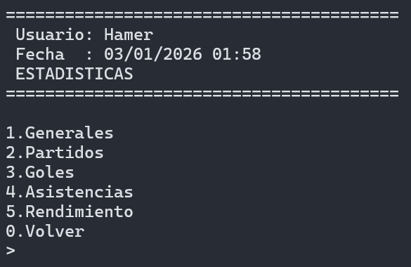

## Logros

Selecciona "7" en el menú principal para acceder al sistema de logros y badges. Los logros están organizados por categorías y niveles de dificultad.

### Categorías de Logros

- **Goles**: Novato (10), Promedio (25), Experto (50), Maestro (100), Leyenda (200)
- **Asistencias**: Novato (5), Promedio (15), Experto (30), Maestro (60), Leyenda (120)
- **Partidos**: Novato (10), Promedio (25), Experto (50), Maestro (100), Leyenda (200)
- **Contribuciones** (Goles + Asistencias): Novato (15), Promedio (40), Experto (80), Maestro (160), Leyenda (320)
- **Victorias**: Novato (5), Promedio (15), Experto (30), Maestro (60), Leyenda (120)
- **Rendimiento**: Novato (7.0), Promedio (7.5), Experto (8.0), Maestro (8.5), Leyenda (9.0)
- **Logros Especiales**: Hat-tricks, Poker de asistencias, Rendimiento perfecto, Ánimo perfecto

### Ver Todos los Logros

1. Selecciona "7" en el menú principal
2. Elige "1" para ver todos los logros
3. Se mostrarán todos los logros con su progreso actual

### Ver Logros Completados

1. Selecciona "7" en el menú principal
2. Elige "2" para ver logros completados
3. Se mostrarán solo los logros que has alcanzado

### Ver Logros en Progreso

1. Selecciona "7" en el menú principal
2. Elige "3" para ver logros en progreso
3. Se mostrarán los logros que estás cerca de completar

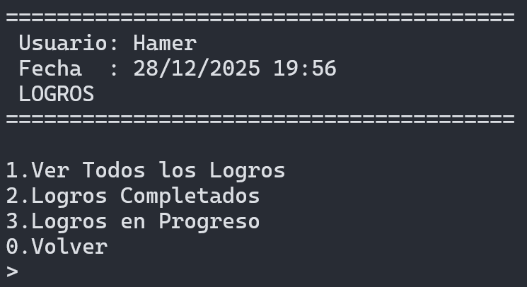

## Gestión Financiera

Selecciona "9" en el menú principal para acceder al módulo de gestión financiera del equipo.

### Agregar Transacción Financiera

1. Selecciona "9" en el menú principal
2. Elige "1" para agregar una nueva transacción
3. Selecciona el tipo:
   - **Ingreso**: Cuotas, sponsors, premios, etc.
   - **Gasto**: Diversos tipos de gastos
4. Elige la categoría:
   - Transporte
   - Equipamiento
   - Cuotas
   - Torneos
   - Arbitraje
   - Canchas
   - Medicina
   - Otros
5. Ingresa la descripción detallada
6. Especifica el monto
7. Indica el item específico si aplica

### Listar Transacciones

1. Selecciona "9" en el menú principal
2. Elige "2" para ver todas las transacciones financieras
3. Se mostrarán ordenadas por fecha

### Modificar Transacción

1. Selecciona "9" en el menú principal
2. Elige "3" para modificar una transacción existente
3. Ingresa el ID de la transacción a modificar
4. Actualiza los datos necesarios

### Eliminar Transacción

1. Selecciona "9" en el menú principal
2. Elige "4" para eliminar una transacción
3. Ingresa el ID de la transacción
4. Confirma la eliminación

### Ver Resumen Financiero

1. Selecciona "9" en el menú principal
2. Elige "5" para ver un resumen completo
3. Se mostrará:
   - Total de ingresos
   - Total de gastos
   - Balance actual
   - Transacciones recientes

### Ver Balance de Gastos

1. Selecciona "9" en el menú principal
2. Elige "6" para analizar el balance por categorías
3. Se mostrará el desglose de gastos por tipo

### Exportar Datos Financieros

1. Selecciona "9" en el menú principal
2. Elige "7" para exportar las transacciones financieras
3. Selecciona el formato deseado (CSV, JSON, HTML, TXT)

### Presupuestos Mensuales

1. Selecciona "9" en el menú principal
2. Elige "8" para abrir el menú de presupuestos mensuales
3. Configura límites y seguimiento por mes

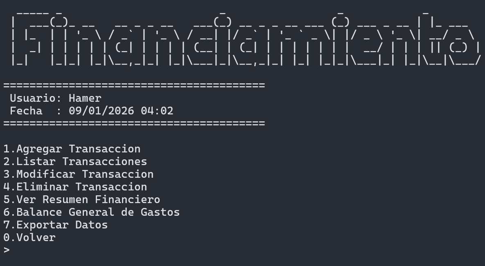

## Gestión de Torneos

Selecciona "10" en el menú principal para acceder al menú de gestión de torneos.

### Crear un Torneo

1. Selecciona "10" en el menú principal
2. Elige "1" para crear un nuevo torneo
3. Ingresa el nombre del torneo
4. Selecciona si tiene equipo fijo
5. Elige el tipo de torneo:
   - Ida y Vuelta
   - Solo Ida
   - Eliminación Directa
   - Grupos y Eliminación
6. Selecciona el formato:
   - Round Robin
   - Grupos con Final
   - Copa Simple
   - Eliminación Directa por Fases
7. Especifica la cantidad de equipos participantes

### Listar Torneos

1. Selecciona "10" en el menú principal
2. Elige "2" para listar todos los torneos
3. Se mostrarán con su estado actual

### Modificar un Torneo

1. Selecciona "10" en el menú principal
2. Elige "3" para modificar un torneo
3. Ingresa el ID del torneo a modificar
4. Actualiza la configuración del torneo

### Eliminar un Torneo

1. Selecciona "10" en el menú principal
2. Elige "4" para eliminar un torneo
3. Ingresa el ID del torneo a eliminar
4. Confirma la eliminación

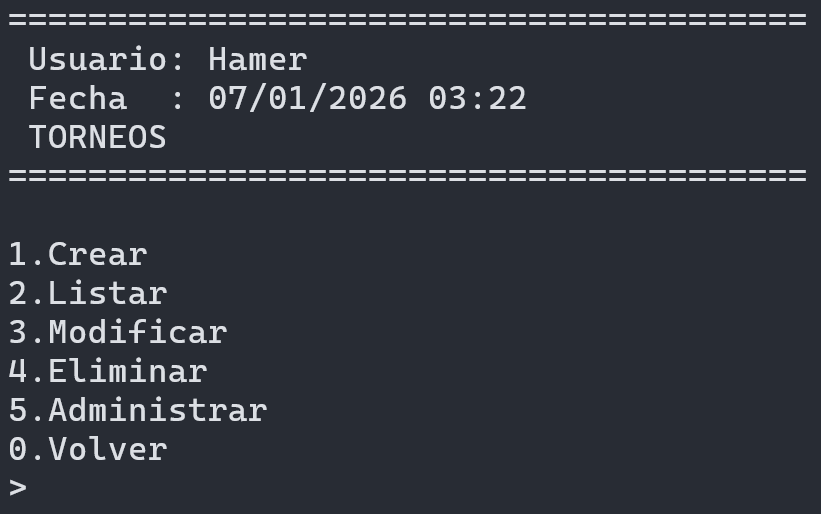

## Gestión de Temporadas

Selecciona "11" en el menú principal para acceder al sistema de gestión de temporadas y ciclos deportivos.

### Crear una Temporada

1. Selecciona "11" en el menú principal
2. Elige "1" para crear una nueva temporada
3. Ingresa el nombre de la temporada (ej: "Temporada 2026")
4. Especifica el año
5. Ingresa la fecha de inicio (formato YYYY-MM-DD)
6. Ingresa la fecha de fin (formato YYYY-MM-DD)
7. Selecciona el estado:
   - Planificada
   - Activa
   - Finalizada
8. Agrega una descripción (opcional)
9. Se crearán automáticamente las fases por defecto:
   - Pretemporada
   - Temporada Regular
   - Posttemporada

### Listar Temporadas

1. Selecciona "11" en el menú principal
2. Elige "2" para listar todas las temporadas
3. Se mostrarán con sus fechas y estado

### Modificar una Temporada

1. Selecciona "11" en el menú principal
2. Elige "3" para modificar una temporada
3. Ingresa el ID de la temporada a modificar
4. Actualiza los datos necesarios

### Eliminar una Temporada

1. Selecciona "11" en el menú principal
2. Elige "4" para eliminar una temporada
3. Ingresa el ID de la temporada
4. Confirma la eliminación

### Administrar una Temporada

1. Selecciona "11" en el menú principal
2. Elige "5" para administrar una temporada
3. Selecciona la temporada a administrar
4. Accede a funciones avanzadas:
   - **Ver Dashboard**: Vista general de la temporada
   - **Asociar Torneos**: Vincular torneos a la temporada
   - **Ver Estadísticas de Fatiga**: Análisis de cansancio acumulado
   - **Ver Evolución de Equipos**: Tendencias de rendimiento
   - **Generar Resumen**: Resumen automático de la temporada
   - **Comparar Temporadas**: Comparación entre diferentes temporadas
   - **Ver Resúmenes Mensuales**: Análisis mes a mes
   - **Exportar Resumen**: Guardar resumen en archivo

### Comparar Temporadas

1. Selecciona "11" en el menú principal
2. Elige "6" para comparar dos temporadas
3. Selecciona los IDs a comparar para ver diferencias

### Funcionalidades Avanzadas de Temporada

#### Dashboard de Temporada

Muestra información completa:
- Total de partidos jugados
- Goles totales
- Promedio de goles por partido
- Equipo campeón
- Mejor goleador
- Total de lesiones
- Fatiga acumulada de equipos
- Evolución de rendimiento

#### Estadísticas de Fatiga

Análisis de cansancio:
- Fatiga acumulada por equipo
- Fatiga acumulada por jugador
- Partidos jugados
- Rendimiento promedio
- Lesiones acumuladas
- Minutos jugados totales

#### Resúmenes Mensuales

Análisis mensual automático:
- Total de partidos del mes
- Goles del mes
- Promedio de goles por partido
- Partidos ganados/empatados/perdidos
- Total de lesiones
- Gastos e ingresos del mes
- Mejor y peor equipo del mes

## Análisis de Rendimiento

Selecciona "12" en el menú principal para ver el análisis de rendimiento.
Desde este menú puedes acceder a **Análisis Básico**, **Comparador Avanzado**, **Análisis Táctico (Diagramas)**, **Entrenador IA** y **Química Entre Jugadores**.

### Funcionalidades del Análisis

- **Comparación Últimos 5 Partidos**: Compara el rendimiento reciente con promedios generales
- **Comparador Avanzado**: Comparaciones entre camisetas, torneos, periodos y condiciones
- **Cálculo de Rachas**: Determina la mejor racha de victorias y peor racha de derrotas
- **Análisis Motivacional**: Mensajes personalizados basados en el rendimiento
- **Visualización de Últimos Partidos**: Resumen de los 5 partidos más recientes con detalles clave

### Métricas Analizadas

- Goles promedio
- Asistencias promedio
- Rendimiento general
- Nivel de cansancio
- Estado de ánimo
- Diferencias con respecto al promedio histórico

### Química Entre Jugadores

Dentro de **Análisis** (opción 12), puedes entrar a **Química Entre Jugadores** para:

- Ver la mejor combinación de jugadores por winrate
- Registrar estadísticas manuales por partido (goles, asistencias, posición y comentario)
- Listar, editar y eliminar registros de química

En la selección de partido para química:

- Los partidos se muestran del más reciente al más antiguo
- Puedes ingresar `0` para cancelar la operación

## Bienestar

Selecciona "13" en el menú principal para acceder a las herramientas de bienestar.

### Funcionalidades de Bienestar

- **Planificación Personal**: Objetivos, rutinas y seguimiento
- **Mentalidad y Hábitos**: Registro de hábitos diarios
- **Entrenamiento**: Planes y controles de práctica
- **Alimentación**: Seguimiento y recomendaciones
- **Mental**: Sesiones y seguimiento mental
- **Informe Personal Mensual (PDF)**: Resumen automático
- **Salud**: Perfil de salud y controles médicos

## Entrenador IA

Selecciona "12" en el menú principal, luego **Entrenador IA** (opción 4) dentro de Análisis.

### Funcionalidades del Entrenador IA

#### Consejos Actuales

1. Selecciona "12" en el menú principal
2. Elige "4" para entrar a Entrenador IA
3. Elige "1" para ver consejos actuales
4. El sistema evaluará tu estado actual:
   - Rendimiento promedio
   - Cansancio promedio
   - Estado de ánimo promedio
   - Partidos consecutivos
   - Riesgo de lesión
   - Derrotas consecutivas
   - Días de descanso
5. Recibirás consejos personalizados por categoría:
   - **Físico**: Recomendaciones sobre cansancio y recuperación
   - **Mental**: Consejos sobre estado de ánimo
   - **Deportivo**: Sugerencias tácticas y de rendimiento
   - **Salud**: Prevención de lesiones
   - **Gestión**: Administración del equipo

#### Niveles de Consejos

- **Información**: Consejos generales
- **Advertencia**: Situaciones que requieren atención
- **Crítico**: Situaciones urgentes que necesitan acción inmediata

#### Historial de Consejos

1. Selecciona "12" en el menú principal
2. Elige "4" para entrar a Entrenador IA
3. Elige "2" para ver historial de consejos
4. Se mostrarán todos los consejos anteriores
5. Podrás ver si seguiste o no cada consejo

#### Evaluar Decisión Pasada

1. Selecciona "12" en el menú principal
2. Elige "4" para entrar a Entrenador IA
3. Elige "3" para evaluar decisiones pasadas
4. El sistema analizará el impacto de seguir o ignorar consejos

#### Configurar Nivel de Intervención

1. Selecciona "12" en el menú principal
2. Elige "4" para entrar a Entrenador IA
3. Elige "4" para configurar el nivel de intervención
4. Ajusta qué tan frecuentes y detallados quieres los consejos

#### Activación Automática

El Entrenador IA se activa automáticamente:
- Antes de un partido importante
- Antes de un torneo
- Al revisar estadísticas
- Cuando detecta situaciones de riesgo

## Exportar Datos

Selecciona "14" en el menú principal (Ajustes) y luego **Exportar** (opción 8) para acceder al menú de exportación.

### Opciones de Exportación

1. **Camisetas** - Exportar datos de camisetas
2. **Partidos** - Exportar datos de partidos (con submenú)
3. **Lesiones** - Exportar datos de lesiones
4. **Estadísticas** - Exportar estadísticas del módulo
5. **Análisis** - Exportar análisis de rendimiento
6. **Estadísticas Generales** - Submenú de estadísticas globales
7. **Análisis Avanzado** - Exportación mejorada con análisis integrado
8. **Base de Datos** - Exportar copia de la base de datos
9. **Todo** - Exportar todos los datos
10. **Todo JSON** - Exportación completa en JSON
11. **Todo CSV** - Exportación completa en CSV
12. **Informe Total PDF** - Reporte integral en PDF

### Formatos Disponibles

Para cada módulo puedes elegir el formato:
- **CSV**: Valores separados por comas (ideal para Excel)
- **TXT**: Texto plano formateado
- **JSON**: Formato estructurado (ideal para integración)
- **HTML**: Página web con tablas

El informe PDF total incluye secciones adicionales con resúmenes financieros, ranking de canchas,
partidos por clima, lesiones por tipo/estado, historial de rachas y distribución de estado de ánimo/cansancio.

### Submenú de Exportar Partidos

- **Todos los Partidos**: Exportar todos los partidos registrados
- **Partido con Más Goles**: Exportar el partido con más goles
- **Partido con Más Asistencias**: Exportar el partido con más asistencias
- **Partido Menos Goles Reciente**: Exportar el partido más reciente con menos goles
- **Partido Menos Asistencias Reciente**: Exportar el partido más reciente con menos asistencias

### Submenú de Exportar Estadísticas

- **Estadísticas Generales**: Exportar estadísticas generales completas
- **Estadísticas Por Mes**: Exportar estadísticas por mes
- **Estadísticas Por Año**: Exportar estadísticas por año
- **Récords & Rankings**: Exportar récords y rankings

### Exportación Mejorada (Análisis Avanzado)

La opción "Análisis Avanzado" proporciona exportación con análisis integrado:

#### Camisetas con Análisis Avanzado
- Eficiencia de goles/asistencias
- Porcentaje de victorias
- Análisis de lesiones
- Métricas de rendimiento
- Tendencias de uso

#### Lesiones con Análisis de Impacto
- Evaluación de gravedad de lesiones
- Comparación de rendimiento antes/después
- Identificación de patrones de lesiones
- Análisis de recuperación

#### Todo con Análisis Avanzado
- Combina todas las funcionalidades mejoradas
- Análisis completo del sistema
- Recomendaciones basadas en datos

### Ubicación de Archivos Exportados

- **Windows**: `%USERPROFILE%\Documents\MiFutbolC\Exportaciones`
- **Linux/macOS**: `./exportaciones`

Los archivos se guardan con nombres descriptivos como:
- `camisetas.csv`
- `partidos.json`
- `estadisticas.html`
- `lesiones.txt`

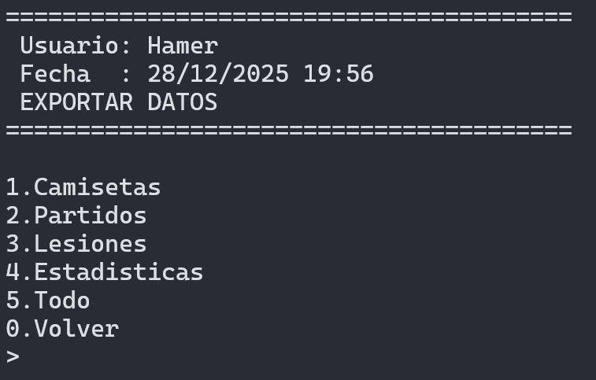

## Importar Datos

Selecciona "14" en el menú principal (Ajustes) y luego **Importar** (opción 9) para acceder a la importación de datos.

### Preparación para Importar

1. Los archivos pueden estar en formato JSON, TXT, CSV o HTML
2. Deben ubicarse en el directorio de importaciones:
   - **Windows**: `%USERPROFILE%\Documents\MiFutbolC\Importaciones`
   - **Linux/macOS**: `./importaciones`
3. Los archivos deben tener los nombres específicos generados por la exportación

### Proceso de Importación

1. Selecciona "14" en el menú principal y luego **Importar**
2. Elige una opción del menú de importación:
   - "1" Importar desde JSON
   - "2" Importar desde TXT
   - "3" Importar desde CSV
   - "4" Importar desde HTML
   - "5" Todo JSON rápido
   - "6" Todo CSV rápido
   - "7" Importar base de datos
4. El sistema validará la estructura del archivo
5. Se verificará que los datos sean correctos
6. Los datos se insertarán en la base de datos
7. Recibirás un resumen de la importación:
   - Registros importados exitosamente
   - Errores encontrados (si los hay)
   - Advertencias sobre datos duplicados

### Validaciones Realizadas

- Estructura de archivo correcta
- Campos requeridos presentes
- Tipos de datos válidos
- Referencias a IDs existentes
- Duplicados (se evita la importación de duplicados)

### Manejo de Errores

Si hay errores durante la importación:
- Se mostrará un mensaje detallado del error
- Los datos no se importarán parcialmente
- La base de datos permanecerá intacta
- Podrás corregir el archivo y reintentar

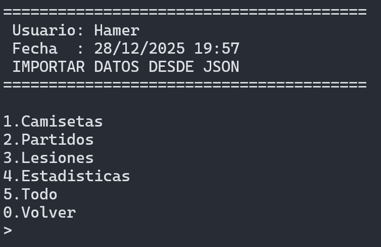

## Configuración (Ajustes)

Selecciona "14" en el menú principal para acceder al menú de configuración del sistema.

### Cambiar Tema de Interfaz

1. Selecciona "14" en el menú principal
2. Elige "1" para cambiar el tema
3. Selecciona uno de los temas disponibles:
   - **Claro**: Fondo claro, texto oscuro
   - **Oscuro**: Fondo oscuro, texto claro
   - **Azul**: Tonos azules
   - **Verde**: Tonos verdes
   - **Rojo**: Tonos rojos
   - **Púrpura**: Tonos púrpuras
   - **Clásico**: Estilo retro
   - **Alto Contraste**: Máxima legibilidad
4. El tema se aplicará inmediatamente
5. La configuración se guardará para futuras sesiones

### Cambiar Idioma

1. Selecciona "14" en el menú principal
2. Elige "2" para cambiar el idioma
3. Selecciona entre:
   - **Español**: Idioma por defecto
   - **Inglés**: English language
4. El idioma se aplicará inmediatamente
5. Todos los menús y mensajes cambiarán al nuevo idioma

### Accesibilidad

1. Selecciona "14" en el menú principal
2. Elige "3" para abrir accesibilidad
3. Ajusta el tamaño del texto o activa alto contraste

### Gestión de Usuario y Seguridad

1. Selecciona "14" en el menú principal
2. Elige "4" para abrir **Usuario**
3. Desde este menú puedes:
   - Mostrar nombre actual
   - Editar nombre visible
   - Agregar usuario local
   - Modificar tu contraseña
   - Quitar tu contraseña
   - Eliminar tu cuenta local (irreversible)
4. Los cambios se aplican al perfil activo

### Ver Configuración Actual

1. Selecciona "14" en el menú principal
2. Elige "5" para ver la configuración actual
3. Se mostrará:
   - Tema actual
   - Idioma actual
   - Nombre visible del perfil
   - Ubicación de la base de datos
   - Directorios de exportación e importación

### Restablecer Valores por Defecto

1. Selecciona "14" en el menú principal
2. Elige "6" para restablecer configuración por defecto
3. Confirma la acción
4. Se restaurarán:
   - Tema: Claro
   - Idioma: Español
   - Otras configuraciones a valores iniciales

### Modo de Menú

1. Selecciona "14" en el menú principal
2. Elige "7" para configurar el modo
3. Selecciona modo Simple, Avanzado o Personalizado

### Exportar / Importar desde Ajustes

1. Selecciona "14" en el menú principal
2. Elige "8" para **Exportar** o "9" para **Importar**

### Actualizar aplicación

1. Selecciona "14" en el menú principal
2. Elige "10" para abrir el flujo de actualización
3. En Windows, podrás buscar y ejecutar la actualización

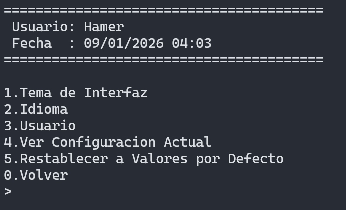

## Consejos de Uso

### Mejores Prácticas

- **Backups Regulares**: Utiliza la función de exportación regularmente para hacer copias de seguridad completas
- **Confirmación de Eliminaciones**: Siempre confirma las operaciones de eliminación para evitar pérdida de datos
- **Análisis Periódico**: Revisa las estadísticas y análisis semanalmente para mejorar el rendimiento
- **Registro Detallado**: Completa todos los campos al registrar partidos para obtener análisis más precisos
- **Uso de Logros**: Completa logros para motivarte a usar la aplicación de manera consistente
- **Entrenador IA**: Presta atención a los consejos críticos del Entrenador IA
- **Gestión Financiera**: Registra todas las transacciones para mantener un control preciso
- **Temporadas**: Organiza tus partidos en temporadas para un mejor seguimiento histórico

### Optimización del Rendimiento

- **Base de Datos**: La base de datos SQLite es eficiente, pero considera hacer backups antes de importaciones grandes
- **Exportaciones**: Usa formatos CSV para análisis en hojas de cálculo, JSON para backups completos
- **Filtros**: Usa las opciones de filtrado en estadísticas para análisis más específicos

## Solución de Problemas

### El programa no se ejecuta

**Problema**: El ejecutable no inicia o muestra error inmediatamente

**Soluciones**:
- Verifica que el archivo ejecutable existe en `bin/Debug/MiFutbolC.exe` (Windows) o `./MiFutbolC` (Linux/macOS)
- Asegúrate de tener permisos para ejecutar archivos en el directorio
- En Linux/macOS, verifica permisos: `chmod +x MiFutbolC`
- Verifica que todas las bibliotecas necesarias estén presentes (SQLite3, cJSON)

### Error al conectar con la base de datos

**Problema**: Mensaje de error relacionado con la base de datos

**Soluciones**:
- Verifica que el directorio de datos existe y tienes permisos de escritura:
  - Windows: `%LOCALAPPDATA%\MiFutbolC\data\`
  - Linux/macOS: `./data/`
- El programa creará automáticamente la base de datos `mifutbol_<usuario>.db` del perfil activo si no existe
- Verifica también que el archivo de usuarios `users.db` exista y sea accesible
- Si la base de datos está corrupta, renómbrala y el programa creará una nueva
- Verifica espacio disponible en disco

### Datos no se guardan

**Problema**: Los cambios no persisten entre sesiones

**Soluciones**:
- Verifica que no hay errores en la consola al guardar
- Revisa que la base de datos no esté en modo solo lectura
- Comprueba que tienes permisos de escritura en el directorio de datos
- Verifica que no estés ejecutando múltiples instancias del programa

### Caracteres extraños en la consola (Windows)

**Problema**: Caracteres especiales no se muestran correctamente

**Soluciones**:
- El programa configura automáticamente UTF-8
- Si persiste, ejecuta manualmente: `chcp 65001` en la consola antes de ejecutar el programa
- Verifica que tu terminal soporta UTF-8

### Error al exportar datos

**Problema**: La exportación falla o no se encuentran los archivos

**Soluciones**:
- Verifica que el directorio de exportaciones existe:
  - Windows: `%USERPROFILE%\Documents\MiFutbolC\Exportaciones`
  - Linux/macOS: `./exportaciones`
- Asegúrate de tener permisos de escritura en ese directorio
- Verifica espacio disponible en disco
- Comprueba que no haya archivos con el mismo nombre bloqueados por otra aplicación

### Error al importar datos

**Problema**: La importación falla o muestra errores de validación

**Soluciones**:
- Verifica que el archivo esté bien formado (JSON/TXT/CSV/HTML)
- Asegúrate de que el archivo está en el directorio correcto de importaciones
- Comprueba que los datos son válidos (IDs existentes, tipos correctos)
- Revisa el mensaje de error específico para identificar el problema
- Intenta exportar primero para ver el formato correcto esperado

### Problemas de rendimiento

**Problema**: El programa se vuelve lento con muchos datos

**Soluciones**:
- Considera archivar datos antiguos exportándolos y eliminándolos de la base de datos activa
- Cierra otras aplicaciones que puedan estar usando recursos
- Verifica que la base de datos no esté fragmentada (SQLite se optimiza automáticamente)
- En sistemas con muchos datos, considera usar filtros para limitar resultados

### Códigos QR no se generan

**Problema**: Error al generar códigos QR

**Soluciones**:
- Verifica que tienes permisos de escritura en el directorio de exportaciones
- Asegúrate de que los datos del partido/camiseta/temporada existen
- Comprueba espacio disponible en disco
- Verifica que no haya caracteres especiales problemáticos en los datos

## Preguntas Frecuentes (FAQ)

### ¿Puedo usar MiFutbolC en múltiples computadoras?

Sí, puedes exportar todos los datos desde una computadora e importarlos en otra. Usa la opción **Ajustes → Exportar → Todo** en formato JSON para crear un backup completo.

### ¿Los datos se guardan automáticamente?

Sí, todos los cambios se guardan inmediatamente en la base de datos SQLite. No necesitas guardar manualmente.

### ¿Puedo editar la base de datos directamente?

Aunque es posible usar herramientas como DB Browser for SQLite, se recomienda usar solo las funciones del programa para evitar corrupción de datos.

### ¿Cómo hago un backup completo?

1. Ve a Ajustes (opción 14)
2. Entra en **Exportar**
3. Selecciona "Todo" (opción 9)
4. Elige formato JSON
5. Guarda el archivo en un lugar seguro
6. Para restaurar, usa **Ajustes → Importar**

### ¿Puedo usar MiFutbolC para múltiples equipos?

Sí, el sistema soporta múltiples equipos, torneos y temporadas. Puedes gestionar toda una liga o múltiples equipos simultáneamente.

### ¿Puedo personalizar los logros?

Actualmente los logros están predefinidos, pero puedes sugerir nuevos logros para futuras versiones del programa.

### ¿El Entrenador IA aprende de mis decisiones?

Sí, el Entrenador IA mantiene un historial de consejos y evalúa si los seguiste o no, ajustando sus recomendaciones futuras basándose en tu perfil.

## Glosario de Términos

- **Camiseta**: Representa un jugador o equipamiento específico usado en partidos
- **Cancha**: Ubicación donde se juega un partido
- **Partido**: Evento deportivo registrado con estadísticas completas
- **Equipo**: Conjunto de jugadores organizados con formación
- **Torneo**: Competición organizada con múltiples equipos
- **Temporada**: Ciclo deportivo con fechas de inicio y fin
- **Fase**: Período dentro de una temporada (Pretemporada, Regular, Posttemporada)
- **Lesión**: Incidente médico que afecta a un jugador
- **Logro**: Meta alcanzable basada en estadísticas
- **Badge**: Insignia otorgada al completar un logro
- **Rendimiento**: Calificación del desempeño en un partido (1-10)
- **Cansancio**: Nivel de fatiga física (1-10)
- **Estado de Ánimo**: Nivel emocional/mental (1-10)
- **Meta-Análisis**: Análisis estadístico avanzado de múltiples variables
- **Outlier**: Dato atípico que se desvía significativamente del promedio
- **Fixture**: Calendario de partidos de un torneo
- **Dashboard**: Panel de control con información resumida
- **Entrenador IA**: Sistema de inteligencia artificial que proporciona consejos

## Conclusión

MiFutbolC es una herramienta completa y profesional para el seguimiento y análisis de datos relacionados con el fútbol. Con su interfaz intuitiva, funcionalidades avanzadas y sistema de análisis profundo, te permite gestionar todos los aspectos de tu experiencia futbolística de manera eficiente y organizada.

### Características Destacadas

✅ **Gestión Integral**: Desde equipamiento hasta finanzas  
✅ **Análisis Avanzado**: Estadísticas profesionales y meta-análisis  
✅ **Sistema Inteligente**: Entrenador IA con recomendaciones personalizadas  
✅ **Gamificación**: Logros y badges para mantener la motivación  
✅ **Flexibilidad**: Múltiples formatos de exportación e importación  
✅ **Personalización**: Temas, idiomas y configuraciones adaptables  
✅ **Organización**: Torneos y temporadas completas  

### Próximos Pasos

1. **Explora las funcionalidades**: Prueba cada módulo para familiarizarte
2. **Registra tus datos**: Comienza a ingresar partidos y estadísticas
3. **Analiza tu rendimiento**: Usa las herramientas de análisis regularmente
4. **Sigue los consejos**: Presta atención al Entrenador IA
5. **Completa logros**: Motívate alcanzando metas
6. **Haz backups**: Exporta tus datos regularmente

¡Disfruta usando MiFutbolC y mejora tu gestión deportiva!

---

**Desarrollado por**: Thomas Hamer  
**Versión**: 3.9.4  
**Última actualización**: 17/03/2026  
**Licencia**: Open Source  

*Manual generado para MiFutbolC - Sistema Integral de Gestión de Fútbol*
